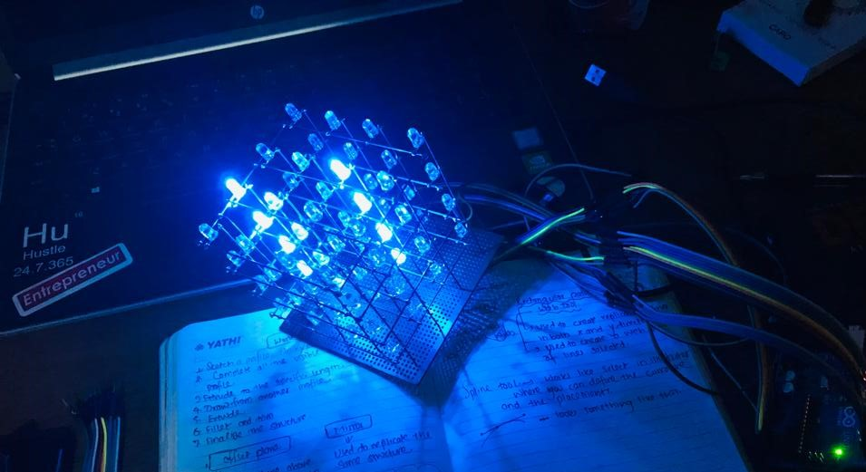

# 4x4x4 LED Cube Project

This repository documents my journey of building a **4x4x4 LED Cube**, including the code, PCB designs, mistakes I made, lessons learned and resources I found along the way. The goal is to use this repository as a **learning journal** and a **reference** for others. This project continues to evolve as I improve the design and explore new features.

 

<!-- # 4-4-4_led_cube

An interactive 4x4x4 LED Cube project with PCB design, code, debugging logs, and lessons learned, documenting my journey and future improvements.

This project was in the back of my head from few time. I thought this would be a nice showpiece and also enhance my learning and I embarked on this journey of creating an interactive 4x4x4 LED Cube. I hope you enjoy it! -->

## Project Overview

The 4x4x4 LED Cube consists of 64 LEDs arranged in a 3D matrix, controlled using a microcontroller (Arduino in this case). The goal was to create various light patterns by programming the cube and experimenting with animations.

<!--
## Repository Structure

444-LED-Cube/
│
├── Code/ # All code files (Arduino scripts or others)
│ └── main.ino # Example of the main code file
│
├── Images/ # All images related to the project
│ └── build-step1.jpg
│ └── final-cube.jpg
│
├── References/ # Any documentation, schematics, or research material
│ └── schematic.pdf
│ └── useful-links.txt
│
├── Debugging/ # Files describing mistakes, debugging notes
│ └── issues.md
│
└── README.md # Main README with an overview of the project -->

## Repository Structure

- **`images/`**: Photos of the build progress and final results.
- **`4-4-4_led_cube_code/`**: Contains the code for programming the LED cube.
- **`4-4-4_led_cube_pcb/`**: Documentation for all PCB versions.
  - **`v1.0/`**: First version of the PCB, including Gerber files and 3D renderings.
  - **`v2.0/`**: Placeholder for future PCB improvements.
  - **`changelog.md`**: Summarizes changes across PCB iterations.
- **`debugging/`**: Notes on issues encountered and how I solved them.

---

## How to Use the Code

1. Open the PlatformIO IDE and in the **Home** tab , select **Open Project** option then load the **`4-4-4_led_cube_code/`** folder.
2. Select the **`main.cpp`** file in the location **`4-4-4_led_cube_code/src/`** and build it.
3. Connect the microcontroller to the computer using a USB cable.
4. Upload the code and enjoy the light patterns!

---

## The Journey So Far

After seeing a lot of videos on led cube and having the interest to make the room a bit colourful with my own creations, I decided to build a 4x4x4 LED Cube.

Firstly, I gathered the materials and then startred working on the cube itself. The first thing I did was made a frame that could hold the led array so that they will be in the same location. Then started soldering the leds after bending their leads. The next step was to add the array to the frame. And after that the cube was done and after the wiring the 4x4x4 cube was ready.

Creating the PCB for this project was an experience in itself. After completing the cube design, I started working on the PCB. I started with the first version of the PCB with the same design as the original prototype design just to make the wiring more neat and the cube more useable.

This is just the beginning! I plan to continue refining the design, adding new features, and maybe even explore **wireless control** to unlock more creative possibilities.

---

## Debugging Log

- **Issue 1**: The **`Arduino Nano`** did not accepted the code.
  
 
  

  - **Solution**: Tried uploading via ICSP header and failed but found out recently that the bootloader selection was wrong and should have been set to `Old Bootloader`.

- **Issue 2**: The light was strobing a lot.
  - **Solution**: Removed the code that was strobing the leds.

---

## Future Improvements

- **Housing**: Develop an improved housing for the cube.
- **Battery**: Add a battery to the cube to be able to use it without power supply.
- **Add control via webserver**: Add a webserver to control the cube from a web browser.
- **Improved Power Management**: Add decoupling capacitors and better trace design.
- **More Advanced Patterns**: Develop smoother animations and light effects.

---

## References

<!-- - [Link to Notion Page](#)
- Original Schematic: `References/schematic-original.pdf` -->

- [LED Cube Tutorial 1](https://www.youtube.com/watch?v=2BlVUKW5hL0)
- [LED Cube Tutorial 2](https://www.youtube.com/watch?v=YUcU2sJs1o8)

---

<!--
4x4x4 LED Cube Project
This repository documents my journey of building a 4x4x4 LED Cube, including the code, mistakes I made, lessons learned, and resources I found along the way. The purpose of this repository is to serve as a reference for myself and others who are interested in building a similar project or learning from my experience.

Repository Structure
Code/: Contains all the code files used for programming the cube.
Images/: Build progress photos and the final cube images.
References/: Documents, schematics, and useful resources I referred to.
Debugging/: A log of mistakes I made and how I fixed them (or thought I fixed them).

What I Learned
Soldering Practice: This project gave me a lot of practice in precision soldering and reinforced the importance of flux.
Multiplexing and Persistence of Vision (POV): I understood how multiplexing works and how to use it efficiently to control multiple LEDs with fewer pins.
Debugging Complex Wiring: I initially misdiagnosed a wiring issue that caused the LEDs in specific rows to behave incorrectly. It turned out to be a common ground issue, not faulty transistors, as I originally thought. -->
